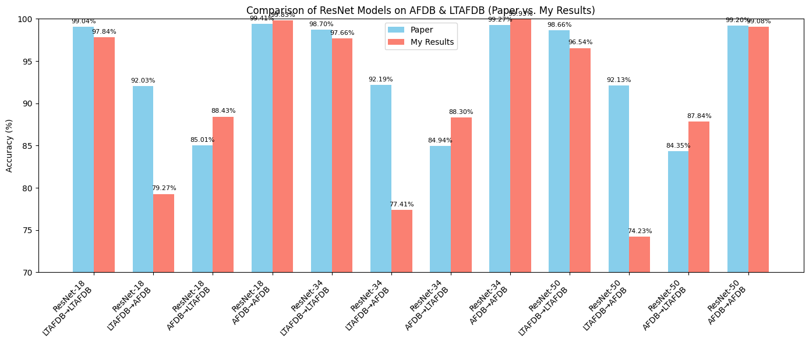

### First Run , Testing on the Test Dataset 

Classification Report 

|Class|Precision|Recall|F1-Score|Support|
|---|---|---|---|---|
|**0**|0.9907|0.9961|0.9934|12,546|
|**1**|0.9909|0.9786|0.9847|5,474|
|**Accuracy**|||**0.9908**|18,020|
|**Macro Avg**|0.9908|0.9874|0.9891|18,020|
|**Weighted Avg**|0.9908|0.9908|0.9908|18,020|

Confusion metric 

|              | Predicted 0 | Predicted 1 |
| ------------ | ----------- | ----------- |
| **Actual 0** | 12,497      | 49          |
| **Actual 1** | 117         | 5,357       |

[WanDB](https://wandb.ai/amitesh_sophro-sophrosyne-technologies-/ecg-afib-detection/runs/4w06uepo/workspace?nw=nwuseramitesh_sophro)

# Final Table 

| **Trained model** |                | **Test data** |          |   |
| ----------------- | -------------- | ------------- | -------- | - |
| **Model**         | **Train data** | **LTAFDB**    | **AFDB** |   |
| Resnet 18         | LTAFDB         | 0.9784       | 0.79271   |   |
|                   | AFDB           | 0.884264      | 0.99827  |   |
| Resnet 34         | LTAFDB         | 0.9766        | 0.774080 |   |
|                   | AFDB           | 0.883019      | 0.999334 |   |
| Resnet 50         | LTAFDB         | 0.96535      | 0.74231   |   |
|                   | AFDB           | 0.87838       | 0.99078  |   |

## 📊 Comparison of Results: Paper vs. My Implementation

| **Model**   | **Train Data** | **Test Data** | **Paper Accuracy** | **My Accuracy** |
|-------------|----------------|----------------|---------------------|-----------------|
| ResNet-18   | LTAFDB         | LTAFDB         | 99.04%              | 97.84%          |
| ResNet-18   | LTAFDB         | AFDB           | 92.03%              | 79.27%          |
| ResNet-18   | AFDB           | LTAFDB         | 85.01%              | 88.43%          |
| ResNet-18   | AFDB           | AFDB           | 99.41%              | 99.83%          |
| ResNet-34   | LTAFDB         | LTAFDB         | 98.70%              | 97.66%          |
| ResNet-34   | LTAFDB         | AFDB           | 92.19%              | 77.41%          |
| ResNet-34   | AFDB           | LTAFDB         | 84.94%              | 88.30%          |
| ResNet-34   | AFDB           | AFDB           | 99.27%              | 99.93%          |
| ResNet-50   | LTAFDB         | LTAFDB         | 98.66%              | 96.54%          |
| ResNet-50   | LTAFDB         | AFDB           | 92.13%              | 74.23%          |
| ResNet-50   | AFDB           | LTAFDB         | 84.35%              | 87.84%          |
| ResNet-50   | AFDB           | AFDB           | 99.20%              | 99.08%          |

